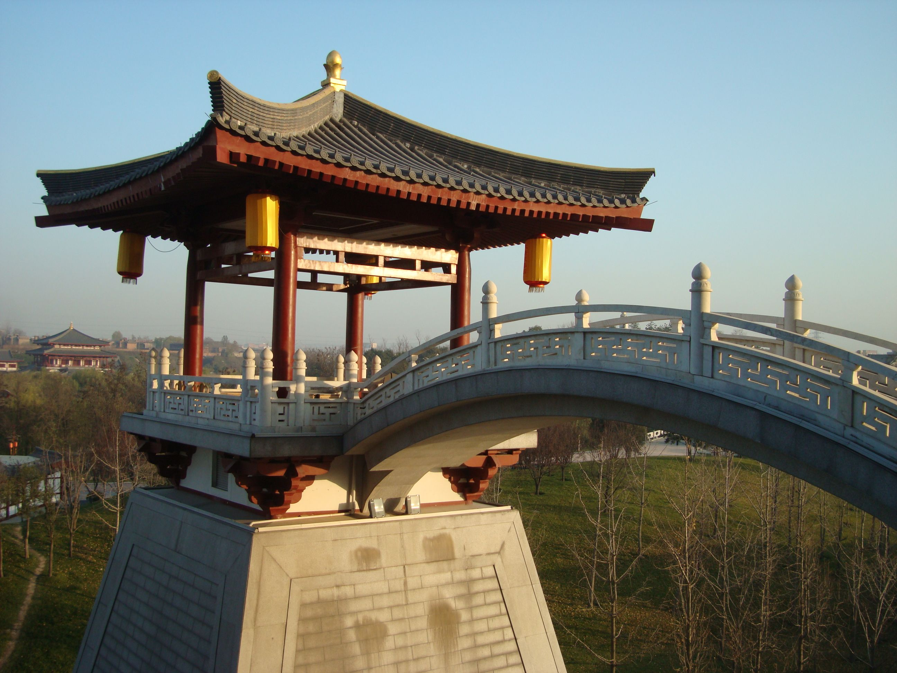
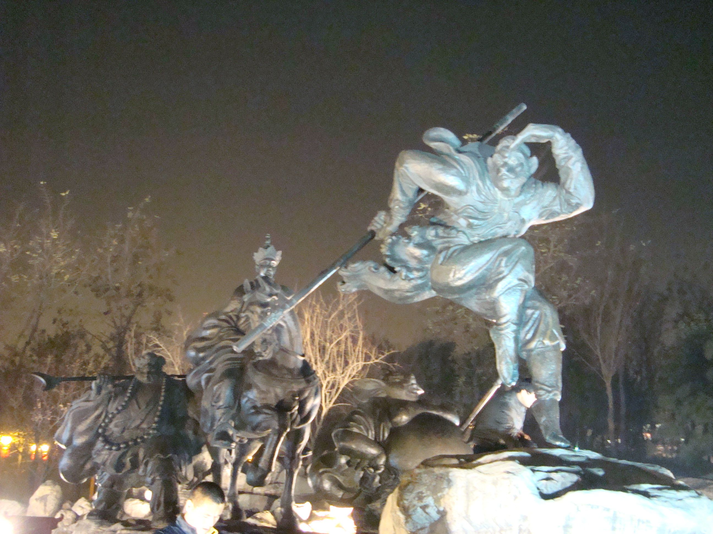
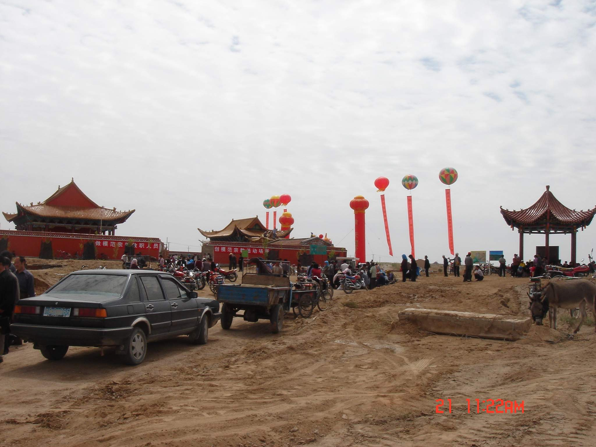
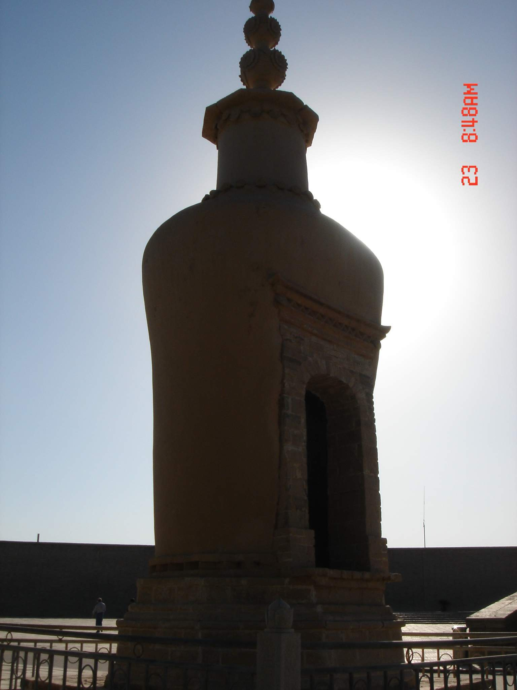
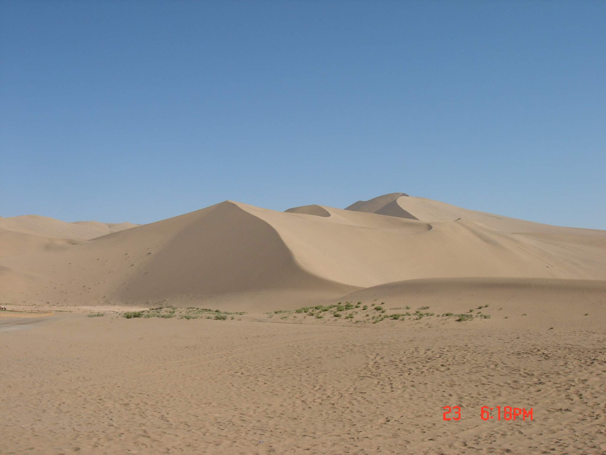
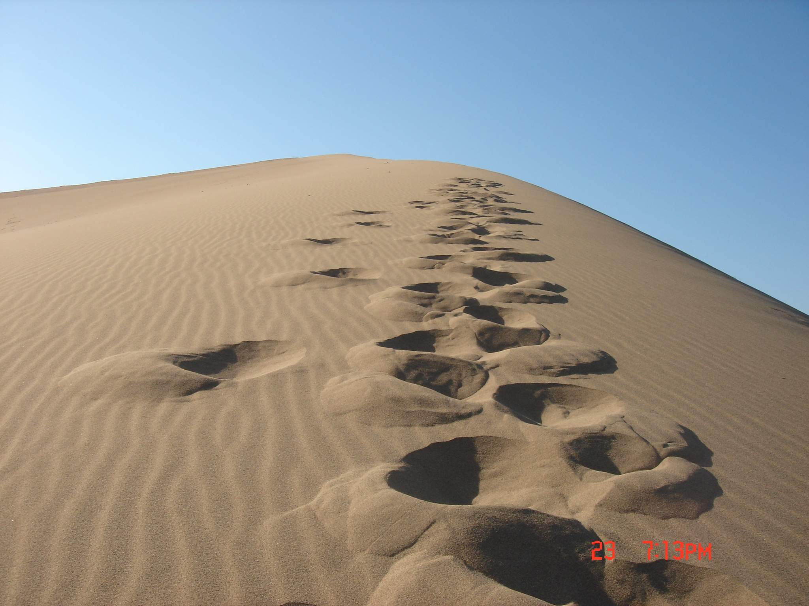
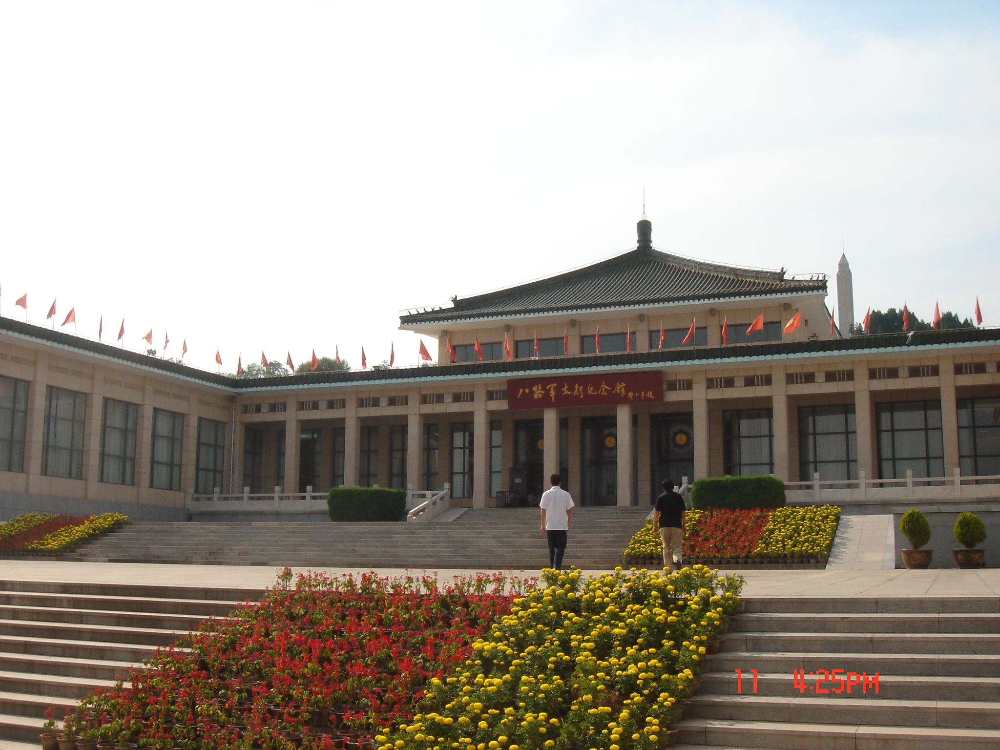

# Prelogue {-}

Descriptions of photos can only be seen in the pdf file.

<!--

```{r, out.width='100%' , fig.align='center', echo=FALSE}
knitr::include_graphics("")
```

-->
# (PART) China{-}

# Sha'an Xi

\m{Xi'an, \\27 Nov. 2008}

```{r, out.width='100%' , fig.align='center', echo=FALSE}

```

\m{Xi'an, 27 Nov. 2008}

```{r, out.width='100%' , fig.align='center', echo=FALSE}

```
\newpage

\m{Xi'an, \\27 Nov. 2008}

```{r, out.width='100%' , fig.align='center', echo=FALSE}

```

# Gansu

\m{Gansu, \\24 June 2006}

```{r, out.width='100%' , fig.align='center', echo=FALSE}

```

\m{Gansu, \\24 June 2006}

```{r, out.width='60%' , fig.align='right', echo=FALSE}

```

\newpage 

\m{Gansu \\24 June 2006}

```{r, out.width='100%' , fig.align='center', echo=FALSE}

```

\m{Gansu \\24 June 2006}

```{r, out.width='100%' , fig.align='center', echo=FALSE}

```


# Shanxi

\m{Yushe, 16 July 2007}

```{r, out.width='100%' , fig.align='center', echo=FALSE}

```

# Xinjiang

# (PART) Europe{-}

# Germany

# Netherlands

# Italy

# France

# Czech

# Austria

# Hungary

# Slovenia

# Switzerland


# (PART) America{-}

Not been there yet